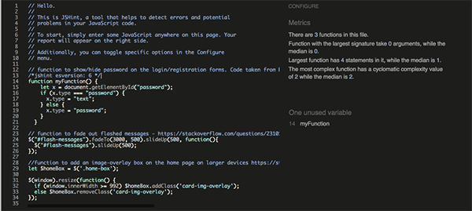
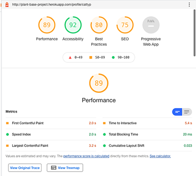

# Plant Base - Testing 

[README.md]( https://github.com/AledPeart/plant-base/blob/main/README.md)

I have tested my deployed site to ensure that it achieves the intended aims of the owner and the expectations of the users by meeting the user stories detailed in the [README.md]( https://github.com/AledPeart/plant-base/blob/main/README.md). I have also manually tested the deployed site across a number of different devices and browsers to ensure that the design, layout and functionality respond as intended. In addition the validity of my HTML, CSS, Javascript and Python code have been checked using the [W3C Markup](https://validator.w3.org/) , [CSS Validation Service](https://jigsaw.w3.org/css-validator/), [JSONLint](https://jsonlint.com/) and [PEP8]( https://pypi.org/project/pep8/) respectively . Finally I have used [Lighthouse](https://developers.google.com/web/tools/lighthouse) in Chrome DevTools to test the accessibility and performance of my site. The specific tests and results are detailed below:

## __Table of Contents__
1. [User Stories](#user-stories)
2. [Manual Functionality Testing](#manual-functionality-testing)
3. [Responsiveness](#responsiveness)
4. [Code Validation](#code-validation)
5. [Lighthouse Testing](#lighthouse-testing)
6. [Testing Results and Bugs](#testing-results-and-bugs)
   - [Resolved Bugs](#resolved-bugs)
   - [Unresolved Bugs](#unresolved-bugs)


## User Stories

### As a new user I want:

### **To quickly understand the purpose of the site and the benefits it can offer me**

 
	
 
-	Clear, uncluttered homepage
-	Introductory paragraph, which informs the users about the site, how it works and what it has to offer
-	Clear navigation links and buttons to guide users towards the next appropriate action
-	Buttons and links change dependent on whether a user is logged in or not


### **To be shown relevant content that is visually pleasing**

 
 
 
-	Clear presentation of the care sheets, laid out in a uniform manner that makes it easy browse.
-	Individual plant sheets show well-presented and clear information on how to care for a plant


### **To be able to browse through the sites content without needing to create an account**


-	Access to browse the sheets does not require users to have an account
-	Pagination prevents the page from becoming too cluttered and makes navigation easier
-	Access to view individual plant sheets does not require users to have an account


### **To be able to view individual plant sheets**


### **To be able to search for specific plants**


-	Search bar on the sheets page allows users to search for plants, by name, botanical name and by category


### **To be signposted to any associated social media accounts**


-	Social media icons are clearly displayed in the page footer


### **To be able to register as a new user quickly and easily**


 - 	A clear simple registration form, which is signposted from the home page and from the navigation menu if a user, is not logged in
 - 	Supporting instruction text provided to help users, and ensure the form is completed correctly
 - 	Inputs are required on all fields and in a specified format so that users are able to enter the information in the correct way


### As a registered user I also want:

### **To be able to login in to my account quickly and easily**


 - 	A clear simple login form, which is signposted from the home page and from the navigation menu if a user, is not logged in


### **To be able to upload my own care sheets for others to use, and for this process to be straightforward and quick**


- 	Users can upload a new care sheet via the form provided.
- 	Form is straightforward and user friendly
- 	Clear instructions provided to the user for each input field
- 	Set options provided to the user for certain fields 
- 	Confirmation message given to the user to let them know the form was submitted successfully


### **To be able to edit my own care sheets quickly and easily**


- 	Edit form is straightforward and user friendly
- 	Form is signposted from the individuals care sheet and from the navigation menus
- 	Input fields are pre-populated with the existing information to help the user and provide a batter user experience
- 	Confirmation message given to the user to let them know the form was submitted successfully

### **To be given guidance on how and what to input on when creating a sheet**


- 	Clear instructions provided to the user for each input field
- 	Set options provided to the user for certain fields 
- 	Confirmation message given to the user to let them know the form was submitted successfully


### **To be able to delete my own care sheets**


- 	Users are able to delete their own sheets
- 	Defensive programming ensures are asked to confirm that they definitely want to delete the sheet
- 	Confirmation message given to the user to let them know the form was deleted successfully
- 	User returned automatically to the sheets page

### **To be able to quickly access all of my own care sheets** 


- 	All a users sheets are displayed on their own individual profile page
- 	Here a user can	view, edit and delete their own sheets
	
### **To be able to navigate around the site quickly and cohesively**


- 	Navigation bar situated at both the top and the bottom of each page
- 	Navigation buttons provided at key locations to aid user navigation

### **I would like the site to use icons that help me to quickly understand the information being presented to me**


- 	Icons used across key areas of the site to reinforce meaning and user understanding
- 	High contrast colors used to increase accessibility.

### As the site owner I want

### **To be able to edit and delete any content from the site**

```
elif session["user"] != owner and session["user"] != "admin":
        flash("You do not have permission to edit this sheet")
```
- Admin/superuser profile provides ability to edit or delete any sheets.

### **To be able to control the flow of information uploaded to the care sheets in order to retain a consistent presentation across the site**

-	Clear instructions provided to the user for each input field
-	Set options provided to the user for certain fields 
-	Inputs are required on all fields and in a specified format so that users are able to enter the information in the correct way

### **That the user be presented with clear instructions to guide them when creating a sheet**

-	Supporting instruction text provided to help users, and ensure the form is completed correctly
-	Clearly labeled input fields to avoid confusion


### **That input validations are used to control the validity of the data uploaded by the user**
```
if request.method == "POST":
            user_input_image = request.form.get("image")
            accepted_image_formats = ("image/png", "image/jpeg", "image/jpg")
            r = requests.head(user_input_image)
            if r.headers["content-type"] in accepted_image_formats:
                final_image = user_input_image
            else:
                final_image = "static/images/placeholder-image-potted.jpg"


```

-	Validation checks ensure images are in the correct format


-	User input validation in place to ensure the information is in the correct format


### **Preventative “server-side” checks to ensure that only registered users can upload to the site**
```
# check if the user is logged in
    if "user" not in session:
        flash("Please Login in order to continue")
        return redirect(url_for("login"))

```

### **Frontend code added to ensure default image to be loaded if a user does not upload one or if there is an error with the upload**
```
onerror="this.onerror=null; this.src='static/images/placeholder-image-potted.jpg'" 
```
-	Additional backend checks also added
```
if request.method == "POST":
            user_input_image = request.form.get("image")
            accepted_image_formats = ("image/png", "image/jpeg", "image/jpg")
            r = requests.head(user_input_image)
            if r.headers["content-type"] in accepted_image_formats:
                final_image = user_input_image
            else:
                final_image = "static/images/placeholder-image-potted.jpg"
```

### **That if the requested page does not exist a custom page is loaded that directs the user back to the site**

- 	Custom 404 and 500 error pages added to the site, with a return to site button and the site’s navigation links


&nbsp; &nbsp; &nbsp; &nbsp; &nbsp; &nbsp; &nbsp; &nbsp; &nbsp; &nbsp; &nbsp; &nbsp; &nbsp; &nbsp; &nbsp; &nbsp; &nbsp; &nbsp; &nbsp; &nbsp; &nbsp; &nbsp; &nbsp; &nbsp;&nbsp; &nbsp; &nbsp; &nbsp; &nbsp; &nbsp; &nbsp; &nbsp; &nbsp; &nbsp; &nbsp; &nbsp; &nbsp; &nbsp; &nbsp; &nbsp; &nbsp; &nbsp; &nbsp; &nbsp; &nbsp; &nbsp; &nbsp; &nbsp; &nbsp; &nbsp; &nbsp; &nbsp; &nbsp; &nbsp; &nbsp;[Back to Top](#table-of-contents)
## Manual Functionality Testing


### Header and Footer (base.html)

#### Do the page header and footer appear and perform as expected?

* __Test__– Does the page logo, navigation items and user icon appear as expected when the user is not logged in?   
__Result__– The result was as expected.

* __Test__– Does the page logo, navigation items and user icon appear as expected when the user is logged in?      
__Result__– The result was as expected.

* __Test__– Do the navigation items and social media icons appear as expected when the user is not logged in??   
__Result__– The result was as expected.

* __Test__– Do the navigation items and social media icons appear as expected when the user is logged in?   
__Result__– The result was as expected.

* __Test__– Do all the anchor links in the page header direct the user to the correct place?   
__Result__– The result was as expected.

* __Test__– Do all the anchor links in the page footer direct the user to the correct place?   
__Result__– The result was as expected.

* __Test__– If a user is logged in does the user icon link to the users profile page?   
__Result__– The result was as expected.

* __Test__– If a user is not logged in does the user icon link to the login page?   
__Result__– The result was as expected.


### Home Page (index.html)

#### Does the home page appear and perform as expected?

* __Test__ – Do the buttons in the text box; appear as expected when the user is not logged in?   
__Result__– The result was as expected.

* __Test__– Do the buttons in the text box; appear as expected when the user is logged in?   
__Result__– The result was as expected.

* __Test__– Do the buttons in the text box; direct the user to the correct place?   
__Result__– The result was as expected.


### Register Page 

#### Does the register page appear and perform as expected?	

* __Test__– Do the text and layout of the registration form appear as expected?   
__Result__– The result was as expected.

* __Test__– Do the appropriate icons sit before the input field name and do both sit and above the input field?   
__Result__– The result was as expected.

* __Test__– Does the instruction text sit below each input field as appropriate?   
__Result__– The result was as expected.

* __Test__– Does the expected validation check prevent users from entering a username that does not meet the required format?   
__Result__– The result was as expected.

* __Test__– Does the expected validation check prevent users from entering an email address that does not meet the required format?   
__Result__– The result was __not__ as expected.

* __Test__– Are users prevented from registering an account with a username that alreay exists and shown the appropriate warning mesage?   
__Result__– The result was as expected.

* __Test__– Does the expected validation check prevent users from entering a password that does not meet the required format?   
__Result__– The result was as expected.

* __Test__– Does the expected validation check ensure that the users confirmation password matches the original before they can be allowed to register?   
__Result__– The result was as expected.

* __Test__– Does the show password checkbox work as expected?   
__Result__– The result was as expected.

* __Test__– Does the login link at the bottom of the registration form link to the login page?   
__Result__– The result was as expected.

* __Test__– On successfully registering is the user given a confirmation message and directed to their profile page?   
__Result__– The result was as expected.


### Login Page 

#### Does the login page appear and perform as expected?

* __Test__– Do the text and layout of the login form appear as expected?   
__Result__– The result was as expected.

* __Test__– Do the appropriate icons sit before the input field name and do both sit and above the input field?   
__Result__– The result was as expected.

* __Test__– Does the instruction text sit below each input field as appropriate?   
__Result__– The result was as expected

* __Test__– If an incorrect username is entered does the user receive the correct flash message, and returned to the same page to try again?   
__Result__– The result was as expected.

* __Test__– If an incorrect password is entered does the user receive the correct flash message, and returned to the same page to try again?      
__Result__– The result was as expected.

* __Test__– Does the show password checkbox work as expected?   
__Result__– The result was as expected.

* __Test__– Does the registration link at the bottom of the login form link to the registration page?   
__Result__– The result was as expected.

* __Test__– If the password and username are correct is the user given a welcome message and redirected to their profile page?   
__Result__– The result was as expected.


### Profile Page 

#### Does the profile page appear and perform as expected?

* __Test__– Does the h1 text and the user icon appear as expected?   
__Result__– The result was as expected.

* __Test__– Does the correct username for the user in session appear in the title and in the welcome paragraph?   
__Result__– The result was as expected.

* __Test__– Does the ‘create new sheet’ button appear below the welcome paragraph and does it link to correct page?   
__Result__– The result was as expected.

* __Test__– Are the users care sheets displayed in a stacked block of 6 per page?   
__Result__– The result was as expected.

* __Test__– Do the correct plant images appear as expected in each sheet?   
__Result__– The result was as expected.

* __Test__– Does each sheet contain the correct name, botanical name and category displayed as intended?   
__Result__– The result was as expected.

* __Test__– Do only sheets created by the user in session appear?   
__Result__– The result was as expected.

* __Test__– Are the displayed sheets paginated as expected?   
__Result__– The result was as expected.

* __Test__– Do the page pagination links work correctly?   
__Result__– The result was as expected.

* __Test__– Does the ‘see more’ button open up the appropriate individual sheet as a new page?   
__Result__– The result was as expected.


### Sheets Page 

#### Does the sheets page appear and perform as expected?

* __Test__ – Does the search bar appear at the top of the page, with the search and refresh button icons as intended?   
__Result__– The result was as expected.

* __Test__– Are users able to search for plant name, botanical name and plant category as intended?   
__Result__– The result was as expected.

* __Test__– Are the search results paginated as expected?   
__Result__– The result was as expected.

* __Test__– Do the search result pagination links work as expected?   
__Result__– The result was __not__ as expected.

* __Test__– Are the users care sheets displayed 6 per page?   
__Result__– The result was as expected.

* __Test__– Do the correct plant images appear as expected in each sheet?   
__Result__– The result was as expected.

* __Test__– Does each sheet contain the correct name, botanical name and category displayed as intended?   
__Result__– The result was as expected.

* __Test__– Do sheets created by all users appear?   
__Result__– The result was as expected.

* __Test__– Are the displayed sheets paginated as expected?   
__Result__– The result was as expected.

* __Test__– Do the page pagination links work correctly?   
__Result__– The result was as expected.

* __Test__– Does the ‘see more’ button open up the appropriate individual sheet as a new page?   
__Result__– The result was as expected.

* __Test__–  Can the sheets page be viewed by users when they are logged in, and when logged out?   
__Result__– The result was as expected.


### View Sheet Page 

#### Does the view sheet page appear and perform as expected?

* __Test__ Is the page layout as expected with all the fields from the database populating the correct parts of the page as intended?   
__Result__– The result was as expected.

* __Test__– Do the icons in the quick facts section appear as intended and correspond to the correct user input?   
__Result__– The result was as expected.

* __Test__ Does the general info text appear underneath the image and does owners name appear at the bottom of the sheet–?   
__Result__– The result was as expected.

* __Test__– If the user is not logged in do they only see the button to return to the sheets page, and does that button correctly link to that page?   
__Result__– The result was as expected.

* __Test__– When the user is in session and is the sheet owner do they see the edit and delete buttons?   
__Result__– The result was as expected.

* __Test__– When the user is in session do they see the return to sheets, and return to profile buttons, and do the buttons link to the correct pages?
   
* __Test__– Does the Edit button link to the edit sheet form as expected?   
__Result__– The result was as expected.

* __Test__– Does the delete button launch the delete modal?   
__Result__– The result was as expected.


### Add Sheet Page 

#### Does the Add sheet page appear and perform as expected?

* __Test__– Do the text and layout of the add sheet form appear as expected?   
__Result__– The result was as expected.

* __Test__– Do all the input field names sit above the input fields and correspond to the correct text information underneath the input field?   
__Result__– The result was as expected.

* __Test__– Do all the input field names with a dropdown menu contain the correct options? 
__Result__– The result was as expected.

* __Test__– Does the submit button sit correctly centered at the foot of the form?   
__Result__– The result was as expected.

* __Test__– Do all the user input validation checks work correctly and the appropriate corresponding messages appear if any entry is blank?   
__Result__– The result was as expected.

* __Test__–If a user does not enter valid URL are they prompted to do so and will the form not submit until one is entered?   
__Result__– The result was as expected.

* __Test__– The default image URL is loaded, as placeholder text should the user not have a URL they wish to upload?   
__Result__– The result was as expected.

* __Test__– If the user does enter a blank URL, they are allowed to do so and in this case a default image is loaded when the site is rendered.   
__Result__– The result was as expected.
 
* __Test__– If the user enters a valid image URL, the images is stored correctly and rendered to the appropriate pages.   
__Result__– The result was as expected.

* __Test__– If the user enters an invalid image URL, the images is replaced by a default image when loaded to the appropriate page.
__Result__– The result was as expected.

* __Test__– On submitting the form, does the user receive a message that their new sheet has been created, and they are returned to the sheets page?   
__Result__– The result was as expected.

* __Test__– Does the cancel button appear correctly and return the user to the sheets page?   
__Result__– The result was as expected.


### Edit Sheets Page 

#### Does the edit sheets page appear and perform as expected?

* __Test__– Do the text and layout of the add sheet form appear as expected?   
__Result__– The result was as expected.

* __Test__– Do all the input field names sit above the input fields and correspond to the correct text information underneath the input field?   
__Result__– The result was as expected.

* __Test__– Do all the input field names pre populate with the correct inputs from the original sheet? 
__Result__– The result was as expected.

* __Test__– Do all the input field names with a dropdown menu contain the correct options? 
__Result__– The result was as expected.

* __Test__– Is the user able to amend the input fields as intended? 
__Result__– The result was as expected.

* __Test__– Does the submit changes button sit correctly centered at the foot of the form?   
__Result__– The result was as expected.

* __Test__–If a user does not enter valid URL are they prompted to do so and will the form not submit until one is entered?   
__Result__– The result was as expected.

* __Test__– The default image URL is loaded, as placeholder text should the user not have a URL they wish to upload?   
__Result__– The result was as expected.

* __Test__– If the user does enter a blank URL, they are allowed to do so and in this case a default image is loaded when the site is rendered.   
__Result__– The result was as expected.
 
* __Test__– If the user enters a valid image URL, the images is stored correctly and rendered to the appropriate pages.   
__Result__– The result was as expected.

* __Test__– If the user enters an invalid image URL, the images is replaced by a default image when loaded to the appropriate page.
__Result__– The result was as expected.

* __Test__– On submitting the form the user receives a message that their new sheet has been updated, and they are returned to the sheets page?   
__Result__– The result was as expected.

* __Test__– Does the cancel button appear correctly and return the user to the sheets page?   
__Result__– The result was as expected.


### Delete Sheet Modal and Functionality

#### Does the delete sheet modal warning appear and perform as expected?

* __Test__– Do the text and layout of the delete modal appear as expected?   
__Result__– The result was as expected.

* __Test__– Does the plant name appear correctly in the warning message?   
__Result__– The result was as expected.

* __Test__– Does the close button and the cancel icon (x) close the modal and return the user to the view sheet page without deleting the sheet?   
__Result__– The result was as expected.

* __Test__– Does the modal delete button delete the sheet and show the user a message that the sheet has been deleted?   
__Result__– The result was as expected.

* __Test__– After the sheet has been deleted is the user returned to the sheets page?   
__Result__– The result was as expected.


### 404 Page

#### Does the 404 page load and perform as expected?

* __Test__– Does the 404 page appear when user is directed to a non existent page, and is the layout as expected?      
__Result__– The result was as expected.

* __Test__ – Does the link provided send the user back to the start screen?       
__Result__– The result was as expected.


### Additional Functionality

#### Are users able to force their way on to pages they should not be able to access?

* __Test__– If the user is not logged in and they try and force their way onto the edit sheet page are they met with a message that they need to login and returned to the login page?   
__Result__– The result was __not__ as expected.

* __Test__– If the user is not logged in and they try and force their way onto the add sheet page are they met with a message that they need to login and returned to the login page?   
__Result__– The result was as expected.

* __Test__– If the user is not logged in and they try and force their way onto the delete sheet pages are they met with a message that they need to login and returned to the login page?   
__Result__– The result was as expected.

* __Test__– If the user is logged in and they try and force their way onto the delete sheet page for another users sheet, are they met with a message that they do not have permission to delete and returned to the sheets page?   
__Result__– The result was as expected.

* __Test__– If the user is logged in and they try and force their way onto the edit sheet page for another users sheet, are they met with a message that they do not have permission to edit that sheet and are then returned to the sheets page?   
__Result__– The result was as expected.

#### Flash messages - flashed messages have been tested as part of the functionality testing above, the following test is for their appearance 

* __Test__– Do the flashed messages appear at the top of the screen in dark text within a yellow strap as expected?   
__Result__– The result was as expected.

* __Test__– Do the flashed messages close by themselves after the set time of 3 seconds?   
__Result__– The result was as expected.&nbsp; &nbsp; &nbsp; &nbsp; &nbsp; &nbsp; &nbsp; &nbsp; &nbsp; &nbsp; &nbsp; &nbsp; &nbsp; &nbsp; &nbsp; &nbsp; &nbsp; &nbsp; &nbsp; &nbsp; &nbsp; &nbsp; &nbsp; &nbsp;&nbsp; &nbsp; &nbsp; &nbsp; &nbsp; &nbsp; &nbsp; &nbsp; &nbsp; &nbsp; &nbsp; &nbsp; &nbsp; &nbsp; &nbsp; &nbsp; &nbsp; &nbsp; &nbsp; &nbsp; &nbsp; &nbsp; &nbsp; &nbsp; &nbsp; &nbsp; &nbsp; &nbsp; &nbsp; &nbsp; &nbsp;[Back to Top](#table-of-contents)

## Responsiveness

The site has been designed with a mobile first approach, and great care has been taken throughout the development process to ensure that the site responds well across all viewing devices. Bootstrap ‘breakpoints’ have been adhered to ensure consistency in the design layouts, and this has been extensively tested using [ChromeDevTools]( https://developer.chrome.com/docs/devtools/) both throughout development and on completion of the build. Some custom CSS media queries have been used to improve the responsiveness of the design reducing padding as appropriate and to allow some text to fit neatly within the design space as intended. e.g

```
/* following media query to reduce font size on smaller screens */

@media screen and (max-width: 576px) {
    .quick-facts-card {
        font-size: 0.8rem;
        padding:    0;
    }
}
```
I have tested my site across various screen widths in order to best replicate the breadth of modern viewing devices, and in line with the Bootstrap breakpoints that were used in the design, namely:

    Extra Small <576px
    Small 576-768px
    Medium 768-992px
    Large 992-1200px
    Extra Large >1200px

Additional testing was carried out on the physical devices that I have access to:
 
    A large screen desktop
    Laptop
    Tablet
    Mobile device

And on the following browsers:

    Chrome
    Firefox
    Safari (ios)

Further responsiveness testing was done using [Responsinator](http://www.responsinator.com/)

## Code Validation

While developing and for final checks I have validated my code using the following validation tools. On submission no errors were showing: 

HTML - [W3C Markup](https://validator.w3.org/)  No Errors Found  
CSS - [CSS Validation Service](https://jigsaw.w3.org/css-validator/)             
 

Javascript -[JSHint]( https://jshint.com/)   1 unused function warning - this function is being called but from outside the script file. I have also added *jshint esversion: 6 */ as Jshint is defaulting to an earlier version  

   

Python – [PEP8](http://pep8online.com/)  Corrected numerous erros such as 'trailing whitespace' and reducing line length to be PEP8 compliant  

  

## Lighthouse Testing

I have used [Lighthouse](https://developers.google.com/web/tools/lighthouse) in Chrome DevTools to test the accessibility and performance of my site. The results are as follows:   

Home     
   
Sheets     
     
Add Sheet        
    
Edit Sheet     
    
Login     
    
Profile     
    
Register     
    
View Page     
    

&nbsp; &nbsp; &nbsp; &nbsp; &nbsp; &nbsp; &nbsp; &nbsp; &nbsp; &nbsp; &nbsp; &nbsp; &nbsp; &nbsp; &nbsp; &nbsp; &nbsp; &nbsp; &nbsp; &nbsp; &nbsp; &nbsp; &nbsp; &nbsp;&nbsp; &nbsp; &nbsp; &nbsp; &nbsp; &nbsp; &nbsp; &nbsp; &nbsp; &nbsp; &nbsp; &nbsp; &nbsp; &nbsp; &nbsp; &nbsp; &nbsp; &nbsp; &nbsp; &nbsp; &nbsp; &nbsp; &nbsp; &nbsp; &nbsp; &nbsp; &nbsp; &nbsp; &nbsp; &nbsp; &nbsp;[Back to Top](#table-of-contents)

## Testing Results and Bugs 

I was regularly testing my code during the development process and as such a number of bugs and errors were found and fixed that way. I have detailed the more significant ones here, and those that were found during testing, as well as some that are as yet unresolved.

### Resolved Bugs

#### Homepage image overlay issue

My original design for the homepage had a text box sitting on top of an image. The following Javascript function was written to ensure that on smaller devices my text box would sit underneath the homepage image by removing the Bootstrap overlay class
```
let $homeBox = $('.home-box');

$(window).resize(function() {
  if (window.innerWidth >= 992) $homeBox.addClass('card-img-overlay');
  else $homeBox.removeClass('card-img-overlay');
});

```
This appeared to work, and when testing my site's layout and responsiveness on DevTools I did not find any issues, however on a physical mobile device, sometimes the text box would cover the main image completely. If the phone was rotated then the issue would resolve itself. I also saw this issue when testing with Responsinator.


Ideally, and with the luxury of more time, I would like to havbe resolved this issue, but I have had to ensure that the mobile homepage renders correctly by re-writing the HTML/CSS, so that the text now sits permanently below the image. 

#### Validation Issue - email address

This error was caught while manually testing the functionality of my registration form. I had not set the ‘type = email’, instead it was set to ‘text’ so was not requiring the user to input their email in an accepted format. This was a straightforward fix.

#### Displaying the username next to the user icon in the navigation bar.

Adding this feature caused an issue whereby I had not defined the username within the route function in app.py. By adding them as variables and passing them correctly when rendering the page templates, as shown here
```
return redirect(url_for("get_sheets"))
    username = mongo.db.users.find_one(
        {"username": session["user"]})["username"]
    return render_template("add_sheet.html", username=username,
                           categories=categorie
``` 
#### Required attribute on the edit_sheet form

When passing the HTML code through the W3 validation check the following error message was found:

```
Error: The first child option element of a select element with a required attribute, and without a multiple attribute, and without a size attribute whose value is greater than 1, must have either an empty value attribute, or must have no text content. Consider either adding a placeholder option label, or adding a size attribute with a value equal to the number of option elements.
```
As I have dropdown boxes, when a user edits a sheet, the existing values are prepopulated ready for them, but this is was causing issues in the validation. For them not to be pre-populated would mean a very poor user experience for the user as they would have to re-enter all the information. The ‘placeholder’ and adding a ‘value >’ 1 did not work in this case and would only serve to confuse the user. So I have removed the required tag, as all the information has already been entered and there is no longer an option to leave the form blank. This resolved the issue.

#### Pagination issue on the users profile

I encountered an error with my pagination function and the way it was applying to the user profile page. The function was working perfectly for the sheets page, displaying the correct number of sheets per page. However on the profile page this was not the case. The sheets were only displaying one per page. After some digging I discovered that I was requiring all sheets that the user had created I had to amend the command to the database to only return sheets created by the session user

```
sheets = list(mongo.db.sheets.find({"created_by": session["user"]}))
```

#### Users being able to force entry onto pages that should have been restricted

It was pointed out to me by my mentor that certain pages allowed users who were not logged in, or who were logged in but did not own a particular sheet, to edit or delete sheets. I understand now that hiding those options on the front end is not the same as including measures inside the backend functionality to prevent this. This was addressed by adding checks inside the relevant functions, to ensure that only users who were logged in or who had created particular sheets could perform certain functionality, along with customised flash messages to inform the user.

```
# check if the user is logged in
    if "user" not in session:
        flash("Please Login in order to continue")
        return redirect(url_for("login"))

    # then check that this user is the owner of the sheet
    elif session["user"] != owner and session["user"] != "admin":
        flash("You do not have permission to edit this sheet")


```

#### Search pagination issue


I was receiving the above error when my search results were large enough to be paginated. I spent a lot of time trying to solve this including removing and re-installing the search indexes in MongoDB. I eventually found the cause was the query not being passed through properly to the second paginated page and beyond. The solution came from a fellow student on slack who had encountered the same thing on his project !( https://github.com/Edb83/self-isolution) The solution involved redefining the query variable and in the search function to ```query = request.args.get("query")```, as well as removing the "POST" and "GET" methods completely and changing the method in the search form from "POST" to "GET".


### Unresolved Bugs 
&nbsp; &nbsp; &nbsp; &nbsp; &nbsp; &nbsp; &nbsp; &nbsp; &nbsp; &nbsp; &nbsp; &nbsp; &nbsp; &nbsp; &nbsp; &nbsp; &nbsp; &nbsp; &nbsp; &nbsp; &nbsp; &nbsp; &nbsp; &nbsp;&nbsp; &nbsp; &nbsp; &nbsp; &nbsp; &nbsp; &nbsp; &nbsp; &nbsp; &nbsp; &nbsp; &nbsp; &nbsp; &nbsp; &nbsp; &nbsp; &nbsp; &nbsp; &nbsp; &nbsp; &nbsp; &nbsp; &nbsp; &nbsp; &nbsp; &nbsp; &nbsp; &nbsp; &nbsp; &nbsp; &nbsp;[Back to Top](#table-of-contents)
#### Image URL Validation

A huge learning experience for me as part of this project has been attempting to implement effective validation of the user inputted image URLs. The challenges were threefold. Firstly to ensure that the users were inputting a valid URL, secondly that the URL was linked to an actual image, and if it was not (if it was broken for example or if there were an error) to ensure that a default placeholder image was loaded. 
In terms of validating the input as a URL, setting type to = URL means that the users input must be in a valid format. Determining if a string is actually an image has not been so straightforward. 

I attempted this firstly by using the url.split() method, to split the string at the final”.” And then compare the extension to my list of accepted formats within the following function:

```
def check_url(url):
format = url.split(".")

if format[-1] not in ["jpg", "png", "jpeg"]:
flash("That URL doesn't seem to link to a valid image. Please try again")
else:
return url

```
After a whole day of tweaking and trying to make this work I simply couldn’t get the outcome I needed. I exhausted a lot of tutor support and in the end I was getting an unexpected bson error:


It was at this point that I decided to explore other options. Following a chat with my mentor I explored using the flask requests library to query URL using a function that was to be tweaked from something found on stack overflow: https://stackoverflow.com/questions/10543940/check-if-a-url-to-an-image-is-up-and-exists-in-python

The function was as collows
```
if request.method == "POST":
	            user_input_image = request.form.get("image")
	            accepted_image_formats = ("image/png", "image/jpeg", "image/jpg")
	            r = requests.head(user_input_image)
	            if r.headers["content-type"] in accepted_image_formats:
	                final_image = user_input_image
	            else:
	                final_image = "static/images/placeholder-image-potted.jpg"
```
I was able to get this working but on initial testing it was proving too unstable.  I was receiving the following error:
```
requests.exceptions.MissingSchema: Invalid URL ‘’: No schema supplied. Perhaps you meant http://

```
and also if  the link was broke, rather than load the default image I was getting this error:

```
urllib3.exceptions.LocationParseError: Failed to parse: 'images.unsplash.co=mnwxmja3fdb8mhxzzwfyy2h8mzr8fgnhy3rpfgvufdb8fdb8fa%3d%3d&ixlib=rb-2.1&auto=format&fit=crop&w=500&q=60', label empty or too long

```

At this stage, due to time pressures I had to admit defeat and remove the function.

As a solution I have settled on ensuring that users are required to add a URL, so that there is a value in the database. To help users I have added the default image URL as a placeholder in the form input field, with instruction that this can be left as a default if the user does not have a preferred image. As a secondary precaution the default image is rendered to the page if there is an error by using the ‘onerror’ image attribute:
```
onerror="this.onerror=null; this.src='static/images/placeholder-image-potted.jpg'"
```
Furthermore to prevent an empty src attribute on the image tag the following conditional statement has been added to the applicable html pages:

```
 
                        <a href="{{ url_for('view_sheet', sheet_id=sheet._id) }}"></a> 
                     
                        <a href="{{ url_for('view_sheet', sheet_id=sheet._id) }}"></a>
                    
```


